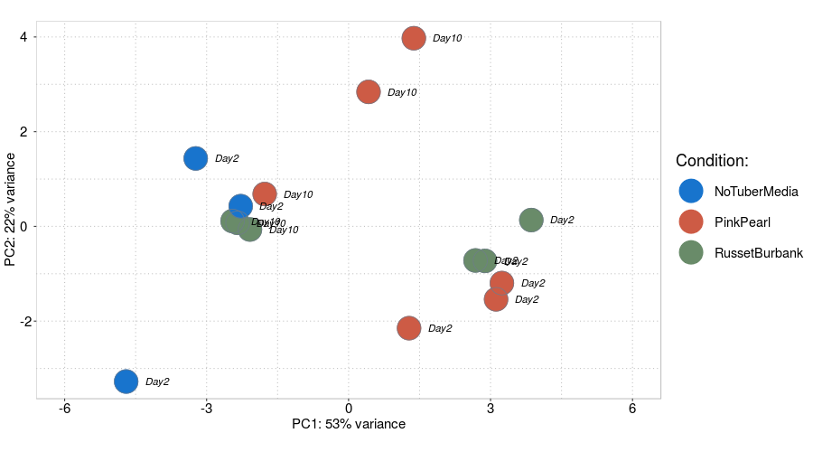

RNAseqFungi: Detailed Manual
================

There are four parts in this document describing step by step the analysis of RNA-seq data from *Synchytrium endobioticum*.
All procedures were done on AWS cloud using several Docker containers designed for this project. All containers can be found [here on GitHub](https://github.com/anabeloff/docker_images).

In general there are two types of scripts associated with each container run. "OnInstance" scripts initiate an instance and run script which initiates Docker container. "InContainer" scripts designed to run inside Docker container and included in the image. All scripts used in this project can be found in this package 'extdata' directory.

Part 0: Docker images and AWS instances
---------------------------------------

Here is a quick introduction into building Docker containers and AWS cloud.
If you don't have images in Docker on your machine, go to [GitHub repository](https://github.com/anabeloff/docker_images) and download folder you need. Then `cd` inside required directory on your machine. There you can find multiple files or directories, but often it's just one `Dockerfile`.

### Build Docker image

All Docker containers used in this project can be found in [GitHub repository](https://github.com/anabeloff/docker_images). For example, run following command inside directory to compile the image for container 'rrnaseq':

``` bash
docker build -t rrnaseq .
```

Image compilation may take some time.
If you are planning to run Docker on AWS platform use ECR service to store Docker images. Each repository in ECR has a button 'push commands', which will show instructions to push container from local machine to ECR repository.
In this case there will be 4 commands:

``` bash
docker build -t rrnaseq .

# Tag container with link ID of disignated repository on ECR
docker tag rrnaseq:latest 123456789.dkr.ecr.ca-central-1.amazonaws.com/rrnaseq:latest

# Login to ECR
$(aws ecr get-login --no-include-email --region ca-central-1)

# Push image to ECR
docker push 123456789.dkr.ecr.ca-central-1.amazonaws.com/rrnaseq:latest
```

### AWS OnInstance tamplate

Basic script template to run on AWS instance.

``` bash

## Important system variables
## These must be outside of 'UDATA' variable.
   
    # System image
    # Amazon Linux version from 2018
    # with pre installed Docker
    AMI_IMAGE="ami-0d4c310a3ab39a06b"
    
    # Memory optimised instance
    # CPU 4
    # ECU 19
    # RAM 32Gb
    # SSD 150Gb
    # PRICE 0.288
    INSTANCE_TYPE="r5d.xlarge"
    THREADS=4

UDATA="$( cat <<EOF
#!/bin/bash

  # Insert BASH script here.

EOF
)"
 
 
# Run instance command
aws ec2 run-instances \
--image-id $AMI_IMAGE \
--iam-instance-profile Name="UltimateRole" \
--security-group-ids yourEnv \
--count 1 \
--instance-initiated-shutdown-behavior terminate \
--user-data "$UDATA" \
--instance-type $INSTANCE_TYPE \
--key-name awsKey \
--query 'Instances[0].InstanceId'
```

AWS `run-instances` command includes option `--user-data` which allows to supply a script which going to be run after instance is initiated. In case of provided example above we put script into `$UDATA` variable using `EOF` trick. Otherwise you can save script into a file and put a path in `--user-data` option.

Options `--security-group-ids` and `--key-name` you have to figure out yourself following AWS manuals on [Security groups](https://docs.aws.amazon.com/AWSEC2/latest/UserGuide/using-network-security.html) and [Keys](https://docs.aws.amazon.com/AWSEC2/latest/UserGuide/ec2-key-pairs.html).

Option `--image-id` specifies the OS image. I generally recommend using Amazon Linux if you going to run Docker. In this example my private image of Amazon Linux with pre-installed and updated Docker is used.

`--instance-type` To run efficient analysis with large files like NGS data choose instances with SSD drive. On these instances, **REMEMBER** all data on SSD will be lost upon shutdown. Data on system drive will remain intact if instance was stopped.

When running `aws` command on newly created instance you always have to provide credentials to access data in your account. To avoid doing it every time on each instance create a [Role](https://docs.aws.amazon.com/IAM/latest/UserGuide/reference_identifiers.html) with rights to use specific or all AWS services. Then you can specify the name of this Role for newly created instance with option `--iam-instance-profile`. In this example I called it "UltimateRole".

Finally, `--instance-initiated-shutdown-behavior` option is here to specify behavior on shutdown. Default is 'stop', what means instance can be restarted in the future. But if you want to use instance only once, then provide 'terminate' option. Just remember, when you using instance with SSD drive all data on it will be lost upon shutdown even if the instance was just 'stopped', not 'terminated'. Data on system drive will remain intact if instance was stopped. Termination will remove all traces of instance existence.

Part 1: Quality control and trimming
------------------------------------

Initial step of every NGS project is a quality check. This part describes a pipeline which allows to run initial quality check on FASTQ files, Trimming and alignment BAM quality.
This section is a first step of the analysis and concentrated on FASTQ files.

Usual procedure with unknown files is to run quality check -&gt; trimm -&gt; run quality check again. This is an interactive procedure and doesn't fit as part of a longer pipeline. Quality control and trimming is done here by three tools:

-   [FastQC](http://www.bioinformatics.babraham.ac.uk/projects/fastqc).
-   QualiMap2 (Okonechnikov, Conesa, and García-Alcalde 2015)
-   Trimmomatic v0.36 (Bolger, Lohse, and Usadel 2014)

All these tools are part of Docker container *qualimapUbuntu14*.
To run either of these tools you need to specify environment variables to the container. But first, if run is going to happen on AWS platform you need perform following steps (see example script 'OnInstance\_quali.sh'):

1.  Prepare SSD drive.
2.  Upload data to SSD from S3.
3.  Run Docker container on SSD.
4.  Upload results back to S3.

For steps 1,2 and 4 you need to specify variables with paths to S3 buckets and working directories (see 'OnInstance\_quali.sh' for details).

For step 3, the container on start initiates the script, which requires certain variables for proper run (see 'InContainer\_quali.sh' for details). But in general there is one main variable `ANALYSIS`. It has three options "qualimap", "trimm" and "fastqc".

To run initial quality check with FastQC specify `ANALYSIS="fastqc"` and make sure files in the working directory.

**FASTQ files NOTE**: 'InContainer\_quali.sh' script is looking for files with **.fastq.gz** extension and names must contain **\_R1** or **\_R2** for paired reads.

As in this project quality of sequencing data was not too good, thus files required some trimming. First we specify `ANALYSIS="trimm"` and additional options for Trimmomatic. Here is an example used in this project:

    CROP_LEN=60
    MIN_LEN=36
    HEADCROP=9

If quality is satisfactory we can move to a next step.

Part 2: Alignment and quality check
-----------------------------------

This part includes two steps: reference based alignment of RNA-seq data with STAR aligner (Dobin et al. 2013) and output BAM quality check.

*rnaseqpipe* container runs 'InContainer\_star.sh' script which looking for **.fastq** files, with names containing **\_R1** or **\_R2**. Make sure to download right type of files from S3 bucket specified in 'OnInstance\_star.sh'.

'OnInstance\_star.sh' script for *rnaseqpipe* requires to specify following variable for Docker container:

`PREFIX_STAR` - specifies file name prefix for STAR output files.
`THREADS` - number of CPUs.

When BAM file is saved we can use Qualimap2 to assess the quality. The important feature of QualiMap2 is that it allows to perform 3'-5' Bias assessment on BAMs. To utilize this feature QualiMap2 requires GTF file supplied for RNA-seq data. For other types of analysis it's GFF. Here we use *qualimapUbuntu14* container and scripts from previous part with `ANALYSIS="qualimap"`.

Now 'OnInstance\_quali.sh' will require additional variables:

`GTFFILE` - path to GTF file on container's working drive.

In addition `PROJECT_DIR` variable should be directed to STAR output directory in S3 repository.

Part 3: Creating Summarized Experiment for DESeq2 analysis
----------------------------------------------------------

Creating Summarized Experiment (SE) is the first step in running RNA-seq analysis in R. It separated from other R scripts as this step is computationally heavy and it's better be run on large AWS instance or HPC environment.

In this step we take BAM files for all samples in analysis, combine it with GFF data to produce single R S4 object that going to in the center of further pipeline. Similarly to previous parts pipeline is made of two scripts.

> OnInstance\_SEobject.sh Starts instance and pulls Docker container -&gt; OnContainer\_SEobject.R creates a SEobjest and saves it to RData file.

The 'OnContainer\_SEobject.R' script is based on instructions for DESeq2 analysis. See [SummarizedExperiment input](http://bioconductor.org/packages/devel/bioc/vignettes/DESeq2/inst/doc/DESeq2.html#summarizedexperiment-input).
For more details on how to create SummurizedExperiment data container for DESeq2 see [Preparing count matrices](http://master.bioconductor.org/packages/release/workflows/vignettes/rnaseqGene/inst/doc/rnaseqGene.html#preparing-count-matrices).

To run this pipeline you need to download all BAM files and GFF annotation in working directory.
Following variables are required by Docker container and must be specified in OnInstance script:

`GFFFILE` - path to GFF file in container.
`SPECIES_NAME` - Character string specifying species names.
`SE_NAME` - Output file name for SE object.

Following variables are required only for OnInstance script:

`PROJECT_DIR` - path to BAM files on S3 repository.
`INDEX_GFF` - path to GFF file on S3 repository.

**IMPORTANT NOTE** Specific to *Synchytrium endobioticum* project GFF file.
'OnContainer\_SEobject.R' contains a step to fix problems specific for *Synchytrium* GFF file.

The code below removes all annotation from 9th column of GFF file leaving only 'ID'. As practice showed function 'makeTxDbFromGFF' used to process annotation prefers to use 'Name' annotation from GFF. At the same time, genes that have no 'Name' but only 'ID' will be removed. The main idea of this step is to make sure that all genes have one single type of annotation. This problem applies to many GFF files and not specific to *Synchytrium*.

``` r
GFF <- data.frame(read.delim(GFFFILE, header=F, comment.char="#", quote="", sep="\t"))
GFF$V9 <- gsub("(\\ID=)([^|]*);\\Name=([^|]*)", "\\1\\2", GFF[,9])
```

The following problem is specific for *Synchytrium* GFF file. Sequences in GFF file can be assigned to "+" or "-" DNA strand. However, start- and stop-codon annotations in *Synchytrium* GFF were only assigned to "+" strand even if associated gene and exons are on "-" strand. That created a warning and all genes and transcripts annotated on "-" strand were automatically removed. To avoid it remove start- and stop-codon annotations from the GFF. Those won't be needed in following analysis.

``` r
GFF<- GFF[GFF$V3 != "start_codon",]
GFF<- GFF[GFF$V3 != "stop_codon",]
```

Part 4: using RNAseqFungi package
---------------------------------

When you created SE object save it as '.RData' so you can continue work on your local RStudio. Following steps wont require much of computing resources.

### Step 1: SE objects

For this project several SE objects provided as external data.

1.  'no2\_SEgene.RData' - main object used in the report.
2.  'no2\_SEgene\_ALL.RData' - SE object with all samples used (including one with only media).
3.  'no2\_SEgene\_day10.RData' - only Day 10 samples and Day 2 NoTuber controls.
4.  'no2\_SEgene\_day2.RData' - only day 2 samples.
5.  'no2\_SEgene\_res.RData' - Day2 and 10 for resistant tuber (Pink Pearl).
6.  'no2\_SEgene\_sus.RData' - Day2 and 10 for susceptible tuber (Russet Burbank).

Basic command to upload SE object in R.

``` r
se <- readRDS(system.file("extdata", "no2_SEgene.RData", package = "RNAseqFungi"))
```

### Step 2: Meatadata table

Now when you have SE object in your environment, it's time to create meta data. The table must outline the experiment design you had in mind from the beginning. It must provide information about Controls, test samples and other possible conditions. Generally to run analysis with DESeq2 you are free to create metadata table with arbitrary names and tags. However, to take advantage of functions provided in `RNAseqFungi` package metadata table *MUST* include specific column names and tags.

-   "strains": Types of strains of individual sample names.
-   "condition": identifying Control and Test samples. Use only two tags here.
-   "clustering": basically a mirror of "condition" column. Only in this column you **MUST** use only two tags "control" and "experiment". This part of the table is used by clustering function.

``` r
mtdata <- data.frame(
  strains = factor(c(rep("RussetBurbank", 6), rep("PinkPearl", 3), rep("NoTuberMedia", 2))),
  condition = factor(c( rep("Control", 3), rep("Tuber", 6), rep("Control", 2)), levels = c("Control", "Tuber")),
  resistance = factor(c(rep("Susceptible", 6), rep("Resistant", 3), rep("Control", 2))),
  clustering = factor(c(rep("control", 3), rep("experiment", 6), rep("control", 2)))
)
row.names(mtdata) <- colnames(seDay10cont)
```

These are *MUST* columns, but you free to add more.

### Step 3: DESeq2 data object

Now we can start using DESeq2. The final product of the package is usually called `dds` object, containing all calculated expression and initial data. The usual sequence of steps is presented by following code:

``` r
# Adding metadata to SE object
(colData(se) <- DataFrame(mtdata))

# Adding SE and design formula to DESeq2
ddsSE <- DESeqDataSet(se, design = ~ condition)

# Creating DDS object
dds <- DESeq(ddsSE)

# Filtering genes by read count
# Only genes with more than 10 reads alined are kept in the data.
keep <- rowSums(counts(dds)) >= 10
dds <- dds[keep,]
```

To make this step easier `RNAseqFungi` has function `DDSdataDESeq2`. It performs the same steps only in one line of code.

``` r
dds <- DDSdataDESeq2(objectSE = se, metaDataTable = mtdata, designFormula = ~ condition)
```

Another important step is to make sure that DESeq2 knows which tag in 'condition' column represents reference samples (control). You can specify it by ordering factor levels in the column. Then DESeq2 will take first level as control. But DESeq2 manual is not really clear on that part in my opinion. So, to be completely sure you specified right tag as a control use following command.

``` r
dds$condition <- stats::relevel(ddsDay2$condition, ref = "Control")
```

Finally, to get results use following code.

``` r
res <- results(ddsDay2, tidy = F)
```

This will output a dataframe with differential expression data. Refer to DESeq2 manual to know more about the object.

### Step 4: PCA analysis

First step in RNA-seq analysis is to perform Principal Component Analysis (PCA) with all samples gene count data. This step allows to see if there is a reason to continue the analysis further. If samples form distinctive clusters, then there got to be significant difference in gene expression.
To draw PCA plot use standard DESeq2 function `plotPCA`. This function uses `ggplot2` package, so it's easy to modify output.

``` r
coldt <- colData(dds)
rld <- rlog(dds)

clr = c("azure3", "darkseagreen4", "coral3", "dodgerblue3")
names(clr) <- unique(coldt[,"strains"])

pcaPl <- plotPCA(rld, intgroup = c("strains")) +
 geom_point(shape=19, size = 12) +
  geom_point(shape=21, size = 12, colour = "lightsteelblue4") +
  scale_colour_manual(values=clr, name = "Tuber:") +
  geom_text(label = coldt[, "day"], size = 4, colour = "black", fontface = "italic", hjust = 0, nudge_x = 0.4) +
  xlim(-6, 6) +
  theme(panel.background=element_rect(fill="white"),
        legend.key = element_rect(fill = "white", color = "white"),
        title=element_text(size=18,colour="black"), 
        axis.title=element_text(size=15,colour="black"),
        axis.text=element_text(size=15, colour="#000000"),
        axis.text.y = element_text(hjust = 0),
        text=element_text(size=18,colour="#000000"),
        panel.grid.major=element_line(size=0.5,colour="#BFBFBF",linetype = "dotted"),
        panel.grid.minor=element_line(size=0.5,colour="#BFBFBF",linetype = "dotted"),
        panel.border = element_rect(fill = NA, colour = "#BFBFBF"),
        legend.position="right",
        panel.margin = unit(1, "lines"))
pcaPl
```

 \#\#\# Step 5: Hierarchical clustering

In previous section PCA clustering showed clear separation between day2 and day10 tuber samples. Considering that day 10 samples are not different from controls we concentrate our analysis efforts on samples from day 2. To lower the variability in sample set we excluded sample 8 (control) leaving only 2 control replicas. To increase the power of the analysis we added samples 10-12 (Susceptible tuber day 10) as control. Samples 10-12 showed low level of variability on PC2 and clustered well with remaining two controls.

*IMPORTANT!* To use clustering function provided with the package MetaData table must include column called 'clustering'. This column must include factor with two levels: 'control' and 'experiment'. Samples identified as experiment will be used for clustering analysis.

``` r
groupsDay2cont10 <- clusterGenes(dds = ddsDay2cont10,
                        annotationTbl = annotation_Tbl,
                        clusterColumns = NA,
                        summarise_clusters = FALSE,
                        value = 1,
                        cutTree = 8,
                        distRows = "euclidean",
                        clusterMethod = "average",
                        clusterNames = NULL,
                        shrinkLFC = F,
                        test = F)
```


The `clusterGenes` functions has two basic modes, controlled by `summarise_clusters` option. First shown on figure above in panel A, is default `FALSE`. It outputs data for all deferentially expressed genes in the set and ordering them by tree. If `summarise_clusters=TRUE` then it produces summarized clusters. Basically, showing average differential expression in each cluster for individual test samples.

References
----------

Bolger, Anthony M, Marc Lohse, and Bjoern Usadel. 2014. “Trimmomatic: A Flexible Trimmer for Illumina Sequence Data.” *Bioinformatics* 30 (15). Oxford University Press: 2114–20.

Dobin, Alexander, Carrie A Davis, Felix Schlesinger, Jorg Drenkow, Chris Zaleski, Sonali Jha, Philippe Batut, Mark Chaisson, and Thomas R Gingeras. 2013. “STAR: Ultrafast Universal Rna-Seq Aligner.” *Bioinformatics* 29 (1). Oxford University Press: 15–21.

Okonechnikov, Konstantin, Ana Conesa, and Fernando García-Alcalde. 2015. “Qualimap 2: Advanced Multi-Sample Quality Control for High-Throughput Sequencing Data.” *Bioinformatics* 32 (2). Oxford University Press: 292–94.
